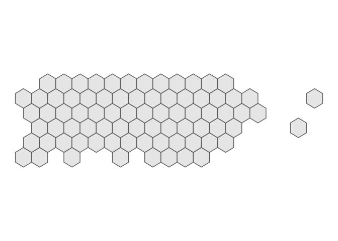

<!-- README.md is generated from README.Rmd. Please edit that file -->

# tidymapgrid

<!-- badges: start -->

[](https://www.tidyverse.org/lifecycle/#experimental)
[](https://CRAN.R-project.org/package=tidymapgrid)
[](https://travis-ci.org/ian-flores/tidymapgrid)
[](https://codecov.io/gh/ian-flores/tidymapgrid?branch=master)
<!-- badges: end -->

The goal of tidymapgrid is to …

## Installation

You can install the released version of tidymapgrid from
[GitHub](https://github.com/ian-flores) with:

``` r
devtools::install_github('ian-flores/tidymapgrid')
```

## Example

This is a basic example which shows you how to solve a common problem:

``` r
library(sf)
library(tidymapgrid)
library(ggplot2)
```

``` r
json_url <- 'https://raw.githubusercontent.com/ian-flores/Hurricane_Maria_Mortality_Analysis/master/analysis/data/pueblos.json'

pueblos <- st_read(json_url)
#> Reading layer `pueblos' from data source `https://raw.githubusercontent.com/ian-flores/Hurricane_Maria_Mortality_Analysis/master/analysis/data/pueblos.json' using driver `GeoJSON'
#> Simple feature collection with 78 features and 3 fields
#> geometry type:  POLYGON
#> dimension:      XY
#> bbox:           xmin: -67.27135 ymin: 17.92688 xmax: -65.24442 ymax: 18.51576
#> epsg (SRID):    4326
#> proj4string:    +proj=longlat +datum=WGS84 +no_defs

ggplot(pueblos) +
  geom_sf()
```


``` r
grid <- get_grid(pueblos, type = 'hexagonal', seed = 40)

ggplot(grid) +
  geom_sf()
```


